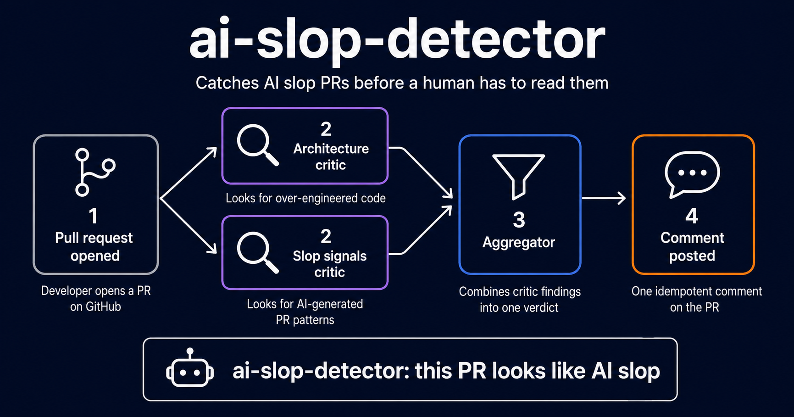
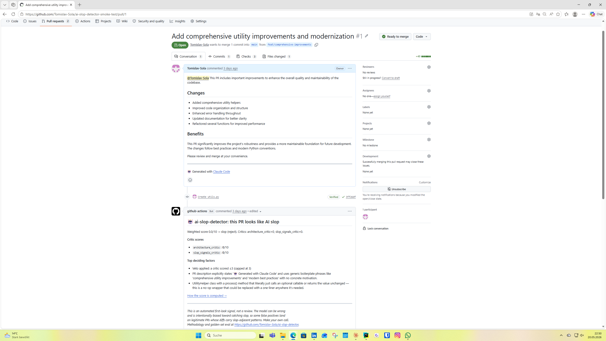

# ai-slop-detector

[](https://www.python.org/)
[](LICENSE)
[](#development)
[](#eval-results)

<p align="center">
  
</p>

A GitHub Action that flags AI-slop pull requests on open, using a two-critic LangGraph pipeline with RAG over the target repo. Built to help OSS maintainers handle the surge of low-effort, AI-generated PRs.

The Action runs once per PR at `on: pull_request: [opened, reopened]`. If the verdict is `is_slop=true`, it posts one idempotent comment naming the deciding factors. If the verdict is `is_slop=false`, it stays silent by default. The classifier is binary and intentional — at PR-open time, maintainer comments, CI timing, and merge status don't exist, so anything granular beyond "this looks like slop" would be guesswork.

## 60-second install

Drop this into `.github/workflows/ai-slop-detector.yml` in your repo:

```yaml
name: AI-slop check

on:
  pull_request:
    types: [opened, reopened]

permissions:
  pull-requests: write
  contents: read

jobs:
  ai-slop-detector:
    runs-on: ubuntu-latest
    steps:
      - uses: Tomislav-Sola/ai-slop-detector@v1
        with:
          anthropic_api_key: ${{ secrets.ANTHROPIC_API_KEY }}
```

Set repository secret `ANTHROPIC_API_KEY` to an Anthropic key you control. Cost is billed to that key — roughly **$0.03 per PR** in Anthropic spend, plus ~30-60 seconds of per-invocation indexing time.

Optional inputs:

| Input | Default | Effect |
|---|---|---|
| `verbose` | `"false"` | Set `"true"` to also comment on PRs that look clean. Default is silent on clean to avoid notification fatigue. |
| `max_tokens` | `"50000"` | Per-run Anthropic token budget cap. The pipeline refuses to start above this estimate. |

## What gets posted

Actual comment posted on a PR the model judges as slop (from the smoke-test repo):



Re-running the Action edits the same comment in place via a hidden HTML marker — it never stacks duplicate comments.

## Eval results

Measured on a 50-entry golden set (10 slop / 40 not-slop, sampled across 8 repos: ruff, pydantic, poetry, godot, Home Assistant, ghostty, curl, tldraw). Sonnet, first-look mode (no post-hoc signals).

| Metric | Value |
|---|---|
| Slop precision | **0.714** (10 true positives / 14 flagged) |
| Slop recall | **1.000** (10/10 slop caught) |
| Slop F1 | **0.833** |
| Accuracy | 92.0% (46/50) |
| Cost per PR | ~$0.025–0.035 |

**All 10 slop PRs were caught with zero false positives on clearly-accepted PRs.** The 4 false positives all land on `is_slop=False` entries whose diffs carry slop-adjacent content — over-engineered patches, AI-style docstrings, drive-by overreach. The model can't see the maintainer's design reasoning but does see the slop-style content. Those FPs are still PRs worth a second look, not arbitrary noise.

## Limitations

Read this section before installing.

- **Golden set is small.** 50 entries is enough to detect catastrophic regressions during development but not to make confident claims about behaviour on long-tail repos. Plan to revisit the eval as it grows.
- **English-only sample.** All 8 source repos have English-language PR descriptions and CONTRIBUTING.md files. Multilingual repos are unmeasured territory.
- **Single-labeler ground truth.** The `is_slop` labels were assigned by one maintainer (the author). Inter-annotator agreement is therefore not measured.
- **Slop is a signal, not a verdict.** A flagged PR still needs a maintainer to decide. Precision of 0.714 means roughly **3 of every 10 flagged PRs are not actually slop** — they're PRs whose content reads slop-adjacent. Use the comment as a "look at this one first," not as a close button.
- **Cost is yours.** The Action calls Anthropic with the key in your repository secret. ~$0.03/PR adds up on a high-traffic repo.
- **No post-hoc signals.** First-look mode is intentional. Close timing, maintainer review comments, and CI status are not used by the critics — they don't exist when the Action fires. This is a structural ceiling on precision at PR-open; some slop is only legible after the maintainer engages.
- **RAG runs at invocation time.** Each Action run indexes the target repo's CONTRIBUTING.md, AGENTS.md, and 50 most-recent merged PR titles + bodies into an ephemeral ChromaDB collection. Adds ~30-60s of cold-start to each run; matches the eval baseline.

## vs other tools

Different scope and different mechanism — comparison is meant to help you pick, not to position this above either.

| Tool | Scope | LLM-backed | Cost | Best for |
|---|---|---|---|---|
| **ai-slop-detector** (this) | Binary slop filter at PR-open | Yes (Claude Sonnet) | ~$0.03/PR | Filtering low-effort AI submissions before review |
| CodeRabbit | Full code review | Yes | Paid SaaS | Replacing or augmenting human review with continuous feedback |
| Coolify Anti-Slop Action | Heuristic slop filter | No (regex / pattern matching) | Free | Fast, deterministic detection of obvious AI footers and markers |

If you want a reviewer, use CodeRabbit. If you want zero-cost detection of the most obvious tells (AI disclosure footers, generic copy-pasted descriptions), use Coolify's heuristic action. If you want an LLM-augmented filter that catches subtler patterns like wrong-arch-layer over-engineering and drive-by overreach, this is what you're looking at.

## How scoring works

Each critic emits an integer score on **0–10** with these anchors:

| Score | Meaning |
|---|---|
| **10** | Exemplary contribution — clear intent, good engineering hygiene |
| **8**  | Solid — common case for legitimate PRs |
| **6**  | Neutral / borderline |
| **4**  | Significant slop markers — vague description, generic AI phrases, or one strong negative signal |
| **2**  | Clear slop — a hard cap fired (AI-disclosure footer, drive-by overreach, sibling-repo mismatch, manipulative @-mention, AI-checklist theatre) |
| **0**  | Pure boilerplate / wrong-target |

The aggregator combines the two critic scores deterministically:

- Weighted score = `0.4 × architecture_critic + 0.6 × slop_signals_critic`
- **Score ≥ 5.0** → `approve` (not slop, maintainer reviews as normal)
- **Score < 5.0** → `reject` (slop, flagged for the maintainer)
- **Veto rule**: any critic ≤ **3** caps the overall score at **3** → automatic reject. One strong slop signal from either critic alone forces a slop verdict.

Thresholds live in `src/ai_slop_detector/aggregator.py` as `_SLOP_THRESHOLD`, `_VETO_THRESHOLD`, and `_VETO_CAP`. Critic weights live in `_DEFAULT_WEIGHTS`.

## Architecture

```
ingest_pr → classify_size → retrieve_context
                              ├─ architecture_critic ─┐
                              └─ slop_signals_critic ─┴→ aggregate → verdict
```

- **`architecture_critic`** flags over-engineering, AI-explanatory docstrings, and wrong-arch-layer placement.
- **`slop_signals_critic`** flags AI-disclosure footers, drive-by overreach, manipulative @-mentions, AI-checklist theatre, sibling-repo mismatch, and heuristic features (duplicate-line ratio, long-function count, debug-print count, etc.).
- **Aggregator** is deterministic — weighted score plus the veto rule above. No third critic, no model in the loop after the two parallel calls.
- Both critics run **in parallel** within one LangGraph superstep via `operator.add` on the reducer. Sonnet for both critics in production; Haiku for `classify_size` (cheap classification).

<details>
<summary>Package layout</summary>

```
src/ai_slop_detector/
├── cli.py                  # Typer CLI: fetch, check, index, eval, view, label, harvest, prelabel, golden-build
├── action_entrypoint.py    # GitHub Action entry point (Docker)
├── github_client.py        # PyGithub wrapper; fetch_pr, fetch_repo_context
├── claude_client.py        # Single gateway for Anthropic SDK calls; tracks cost_usd
├── state.py                # TriageState + Pydantic models
├── budget.py               # Per-run token budget via ContextVar + BudgetExceeded
├── rag.py                  # ChromaDB index + sentence-transformers retrieval
├── harvest.py              # Candidate PR harvesting with diversity constraints
├── prelabel.py             # Heuristic pre-labeling pipeline
├── aggregator.py           # Deterministic binary aggregator (veto rule, threshold)
├── golden.py               # Golden fixture builder + validator
├── eval.py                 # Eval harness — runs pipeline against golden set
├── labeler_app.py          # Streamlit manual labeling tool
├── eval_viewer_app.py      # Streamlit eval results viewer
└── graph/
    ├── nodes.py            # LangGraph node functions
    └── pipeline.py         # StateGraph assembly, run_pipeline, budget pre-check
tests/
└── fixtures/
    ├── golden/             # 50-entry golden set (one JSON per PR + manifest)
    └── llm/                # Recorded LLM response sequences for --fake mode
```
</details>

## CLI usage

The CLI is what you'd use to debug a specific PR or extend the golden set. The Action does not require it.

```bash
# Install in editable mode
pip install -e ".[dev,eval]"

# Run the pipeline against a single PR
ai-slop-detector check owner/repo 42
ai-slop-detector check owner/repo 42 --json        # full TriageState
ai-slop-detector --fake check owner/repo 42        # replay cached LLM responses

# Index a repo manually (the Action does this automatically per invocation)
ai-slop-detector index owner/repo

# Run the eval suite (Sonnet, ~$1.50 for the 50-entry golden set)
ai-slop-detector eval
ai-slop-detector eval --model haiku                # cheap iteration, ~$0.30

# Browse eval results
ai-slop-detector view outputs/eval_runs/<run_id>.json

# Golden-set extension flow: harvest → prelabel → label → golden-build
ai-slop-detector harvest owner/repo --max-prs 50
ai-slop-detector prelabel
ai-slop-detector label data/pre_labels_v2.jsonl
ai-slop-detector golden-build
```

`ANTHROPIC_API_KEY` and `GITHUB_TOKEN` come from your shell environment. `.env` provides fallbacks for any variable not set in the shell.

## Development

```bash
pip install -e ".[dev]"
pytest                    # fake-mode by default — no live credentials needed
pytest --cov=src/ai_slop_detector --cov-report=term-missing
```

## Contributing

See [CONTRIBUTING.md](CONTRIBUTING.md) for local setup, how to run the eval, how to propose a new golden-set fixture, and the conventional-commit style this repo uses.

## License

MIT — see [LICENSE](LICENSE).
